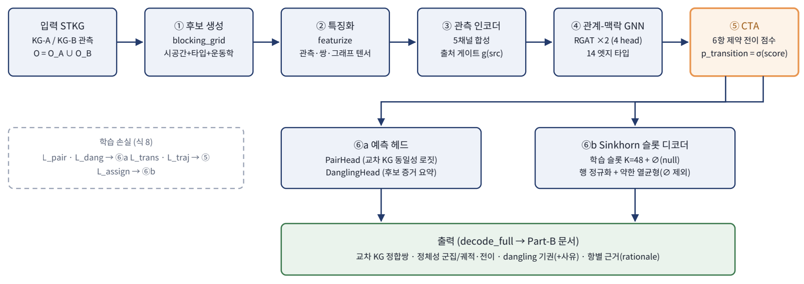

<div align="center">

# CITA-Net

**Constraint-aware Identity-Trajectory Alignment Network**

다중 정보망(multi-robot/multi-source) 전장 **시공간 지식그래프(STKG)** 상의 **개체정합(Entity Alignment)**

<sub>의미 , 시공간 , 운동학 , 상태전이 , 관계 , 출처 신뢰도 제약을 단일 모델에 통합</sub>

`Python ≥ 3.10 (64-bit)` , `PyTorch (CPU)` , `의존성 최소(torch , numpy , PyYAML)` , `torch-geometric/rdflib 불필요`

</div>

---

## 개요 (Overview)

서로 다른 두 정보망(**KG-A** / **KG-B**)이 같은 전장을 **비동기,부분적으로** 관측하면, "어떤 관측들이 동일한 실체인가?"를 판정해야 한다. CITA-Net은 **관측(observation) 중심 STKG**를 입력받아 다음을 수행한다.

1. 동일 실체의 관측을 **정체성(identity)으로 군집화**
2. cross-KG의 **1:1 정합쌍** `(e^A, e^B)` 산출
3. 한쪽 정보망에만 보인 객체(**dangling**)는 강제로 매칭하지 않고 **abstain(보류)** (정밀도 보존)

핵심은 의미(텍스트/타입),시공간,**운동학(kinematics)**,**상태 전이 호환성**,**관계 이웃**,**출처 신뢰도** 제약을 하나의 **Constraint-aware Transition Attention(CTA)** 로 통합하고, **Sinkhorn 슬롯 디코더**로 군집과 dangling을 동시에 산출하는 것이다.

> 코드 수준의 전체 상세(모든 수식,구조,하이퍼파라미터,실험)는 **[`CITA-Net_TECHNICAL_REPORT.md`](CITA-Net_TECHNICAL_REPORT.md)** 참고

---

## 주요 특징 (Key Features)

- **제약 통합 CTA** — `score = w₀,sim_sem + b_time + b_motion + b_state + b_rel + b_src`. 각 항을 설정으로 on/off → ablation이 설정 변경만으로 가능
- **출처-인지 다중모달 인코더** — 텍스트,시공간(Fourier),상태,타입,출처 5채널을 출처 신뢰도 게이트 `g(src)`로 가중합
- **관계-맥락 GNN(RGAT)** — 동일트랙,관계엣지,공통이벤트로 2-hop 메시지패싱(자체 구현, torch-geometric 불필요)
- **Sinkhorn 슬롯 디코더** — K개 정체성 슬롯 + ∅ 슬롯, 행-확률 정규화로 군집 + dangling 흡수
- **두 가지 정합 불변(invariants)** — 관측→정체성 **다대일**, 정체성↔정체성 **일대일**, dangling **강제매칭 금지**
- **스케일** — 100만 트리플 suite에서 **그리드+시간 블로킹**(recall≥0.98, ~10× 축소)과 **섹터 스트리밍**(peak ~16 MB)으로 CPU에서 동작
- **완전 재현** — 결정론적 시드 기반 데이터 생성, 단일 스크립트로 온톨로지까지 emit

---

## 모델 구조 (Architecture)



**CTA 항(요약)**

| 항 | 수식 | 의미 |
|---|---|---|
| `sim_sem` | `cos(h_i, h_j)` | 의미 유사도(인코더+GNN) |
| `b_time` | `−BIG if t_j<t_i−ε else 0` | 역방향 전이 금지(하드, 비학습) |
| `b_motion` | `−α,softplus((req−feas)/β)` | 운동학 위반 소프트 벌점 |
| `b_state` | `γ,log(C[s_i,s_j]+ε)` | 상태 전이 호환행렬(비대칭) |
| `b_rel` | `δ,jaccard(이웃_i, 이웃_j)` | 관계 이웃 중첩 |
| `b_src` | `SrcBias[src_i, src_j]` | 출처쌍 학습 바이어스 |

**운동학 feasibility**: `required = dist/Δt`, `feasible = max(v_max(type,state)) + (cep_i+cep_j)/Δt`, `feasible ⇔ required ≤ feasible`

---

## 폴더 구조 (Repository Structure)

```
CITA-Net/
├── src/citanet/
│   ├── config.py               # 하이퍼파라미터 dataclass + YAML 로더
│   ├── engine.py / engine_large.py   # 학습/평가 (소형 / 대형 스트리밍)
│   ├── decode.py               # 디코드 (greedy + M3 Sinkhorn full)
│   ├── eval.py                 # 평가 지표
│   ├── losses.py               # 5개 손실항 + total_loss
│   ├── serialize.py / output_schema.py   # Part-B 출력 + 스키마 검증
│   ├── model/
│   │   ├── citanet.py          # 최상위 모델 CITANet
│   │   ├── encoder.py          # 5채널 출처-게이트 인코더
│   │   ├── graph_encoder.py    # RGAT (관계-맥락 GNN)
│   │   ├── cta.py              # Constraint-aware Transition Attention
│   │   ├── decoder.py          # Sinkhorn 슬롯 디코더
│   │   ├── heads.py            # PairHead / DanglingHead
│   │   ├── featurize.py        # FeatureSpace / ScenarioFeatures / REL_NAMES
│   │   └── text.py             # Vocab / LearnedTextEncoder
│   └── data/
│       ├── schema.py           # Observation/Entity/Landmark/Event/Relation
│       ├── ontology.py         # 온톨로지 접근 API
│       ├── loader.py / stream.py     # 로더 (JSON-LD / 섹터 스트리밍)
│       ├── blocking.py / blocking_grid.py   # 후보 생성 (brute / grid+time)
│       └── kinematics.py       # 운동학 feasibility
├── scripts/
│   ├── gen_dataset.py              # 소형 suite 생성기
│   ├── gen_dataset_large.py        # 대형 suite 생성기 [동결]
│   ├── gen_dataset_hill395.py      # ★ 백마고지 suite 생성기
│   ├── train.py / evaluate.py / predict.py   # 소형 파이프라인
│   ├── train_large.py              # 대형 학습/평가
│   ├── extract_hill395_results.py  # ★ 정량/정성 결과 추출
│   ├── plot_hill395_results.py     # ★ 결과 그래프(PNG)
│   └── make_hill395_deck.py        # ★ 발표자료(PPTX)
├── configs/
│   ├── cita_full.yaml / cita_full_large.yaml
│   └── cita_full_hill395.yaml      # ★ 백마고지 학습 설정
├── data/
│   ├── battlefield_stkg_dataset/   # 소형 suite (JSON-LD scenarios) [동결]
│   ├── battlefield_stkg_large/     # 대형 suite (N-Triples sectors) [동결]
│   └── battlefield_hill395_large/  # ★ 백마고지 suite
├── tests/                          # pytest (data / model / pipeline)
├── hill395_experiment_results/     # ★ 실험 산출물(지표,그림,정성,PPTX)
├── CITA-Net_TECHNICAL_REPORT.md    # ★ 코드 기반 전체 기술 문서
└── README.md
```

> `[동결]` = 기존 동결 데이터(변경 금지). 백마고지 작업은 **새 형제 디렉토리/스크립트로만** 추가했다.

---

## 설치 (Installation)

**64-bit Python**이 필요하다(torch는 32-bit Windows 휠을 제공하지 않음)

```bash
# 리포 루트에서
python -m venv .venv                          # 64-bit 인터프리터 사용 (예: py -3.11)
.venv/Scripts/python -m pip install -e .       # Windows
# .venv/bin/python  -m pip install -e .         # POSIX
```

- **필수 의존성**: `torch`, `numpy`, `PyYAML` (+ 테스트 `pytest`)
- **선택 의존성**: 결과 그래프/발표자료 산출 시 `matplotlib`, `python-pptx`

```bash
.venv/Scripts/python -m pip install matplotlib python-pptx   # 그래프/PPTX 생성용(선택)
```

---

## 데이터셋 (Datasets)

세 개의 절차적(procedural),결정론적 suite를 제공한다. **train/dev/test는 분리 시드베이스**로 누수가 없다.

### ★ 백마고지 (Hill 395) — `data/battlefield_hill395_large/`

한국전쟁 백마고지 전투(1952-10-06~15)를 도메인으로 한 **관측형 대형 suite**. 실제 사료(부대 편제,지형,관계 술어,일자별 타임라인)를 **시드**로, 동일 유형 부대를 대량 등장시키고(소부대 분해 → hard negative) 한쪽 정보망만 본 부대는 dangling, 한국어 라벨 패러프레이즈,오식별 노이즈를 주입해 **100만 트리플 규모**로 절차적 확장한다.

```
ontology/{classes,states,sources,relations}.yaml, context.jsonld   # 생성기가 emit
sectors/sec_{train|dev|test}_####/
  stkg.nt                # 정규 STKG (N-Triples, 1줄=1트리플)
  observations.jsonl     # 평탄화 관측 캐시 (학습 fast-path)
  manifest.json
  labels/{gold_identities,dangling}.json
splits/{train,dev,test}.txt
manifest_global.json
```

- **규모**: 1,005,101 트리플 / 75 섹터(train 50 , dev 12 , test 13) / 51,310 관측
- **타입(진영-기능)**: ROK/CCF_Infantry, US/ROK_Tank, ROK/US/CCF_Artillery, Mortar, CCF_AA, QuadFifty, Engineer, VehicleColumn, Searchlight, Unit, UNKNOWN (진영을 타입에 내장 → 진영 간 오병합 구조적 차단)
- **상태(11)**: Moving, Halted, Approaching, Engaging, Occupying, Holding, Emplaced, Firing, Withdrawing, Unknown, Destroyed
- **출처(7)**: KG-A(VISUAL_OBS,RADAR,ARTILLERY_OBS) / KG-B(AERIAL,SIGINT,ACOUSTIC,HUMINT)

### 소형 / 대형 suite (참고, 동결)

- `data/battlefield_stkg_dataset/` — JSON-LD scenario 기반 소형 suite(파이프라인,ablation 검증용) `scn_0001`은 고정 dev probe(관측 29, A6/B6, 매칭 5, dangling 2)
- `data/battlefield_stkg_large/` — N-Triples sector 기반 대형 suite(1,001,133 트리플 / 95 섹터)

---

## 사용법 (Usage)

```bash
PY=.venv/Scripts/python      # (POSIX는 .venv/bin/python)
```

### 1) 데이터셋 생성 (백마고지)

```bash
$PY scripts/gen_dataset_hill395.py --build-suite           # ~1M 트리플
#  부분 생성:  --split dev --n-sectors 2
#  온톨로지만:  --emit-ontology
#  knobs: --identities-per-sector --obs-per-track --dangling-ratio --n-robots --target-triples --seed
```

### 2) 학습 + dev/test 평가

```bash
$PY scripts/train_large.py --config configs/cita_full_hill395.yaml --full-sectors --epochs 40
#  CPU 친화(섹터 서브샘플): --sectors-per-epoch 12  (--full-sectors 생략)
#  → runs/cita_full_large/metrics.json + Part-B 샘플 출력
```

### 3) 결과 추출 , 그래프 , 발표자료

```bash
$PY scripts/extract_hill395_results.py     # 정량/정성 결과 → hill395_experiment_results/
$PY scripts/plot_hill395_results.py        # 그래프 PNG → .../figures/
$PY scripts/make_hill395_deck.py           # 발표자료 → .../CITA-Net_백마고지_발표자료.pptx
```

### 4) 테스트

```bash
$PY -m pytest tests/test_hill395_pipeline.py -q   # 백마고지 구조 무결성
$PY -m pytest -q                                   # 전체(소형/대형 회귀 포함)
```

### (참고) 소형 suite 파이프라인

```bash
$PY scripts/gen_dataset.py --build-suite
$PY scripts/train.py    --config configs/cita_full.yaml
$PY scripts/evaluate.py --config configs/cita_full.yaml --split dev
$PY scripts/predict.py  --config configs/cita_full.yaml --scenario scn_0001
```

---

## 실험 결과 (Results — 백마고지)

Full CITA-Net, 전체 50 train 섹터 × 40 epoch (CPU). 학습 수렴: 총손실 17.63 → **1.63**, best dev-F1 **0.693**

| 지표 | dev | test |
|---|---:|---:|
| **Precision** | 0.871 | **0.895** |
| **Recall** | 0.548 | 0.561 |
| **F1** | 0.669 | **0.686** |
| Wrong-merge rate | 0.132 | 0.121 |
| Fragmentation rate | 0.730 | 0.685 |
| Trajectory consistency | 0.757 | 0.754 |
| Impossible-transition rate | 0.243 | 0.246 |
| Dangling precision / recall | 0.682 / 0.582 | 0.621 / 0.571 |
| Streaming peak memory | 16.2 MB | 16.5 MB |

**해석**: 고정밀(P≈0.9),중회수(R≈0.56) 프로파일. 동일 진영,동일 type 보병 소부대(hard negative)에 오병합이 집중되나 확신도가 낮고(보수적 abstain), 한쪽만 본 부대는 dangling으로 다수 정탐. 그래프,정성 사례는 [`hill395_experiment_results/`](hill395_experiment_results/) 참고.

---

## Ablation (소형 suite)

각 구성요소의 기여를 동일 데이터에서 분리 검증할 수 있다(설정 변경만으로).

```bash
$PY scripts/ablation_m2.py   # 관계 인코더 on/off — 하드 포지티브(id_0003) 회복 9/9 vs 2/9
$PY scripts/ablation_m3.py   # b_motion on/off — 불가능 전이 확률 ~2.5× 증가
```

대형/백마고지 suite에서도 `cta.enabled_terms`(b_motion/b_state/b_rel/b_src),`graph.enabled`,`encoder.use_source_gate`,`decoder.enabled`를 끄는 설정으로 동일한 ablation을 돌릴 수 있다.

---

## 한계 (Limitations)

**모든 보고 수치는 통제된 합성(synthetic) suite에 대한 결과이며, 실제 전장 데이터에 대한 일반화 성능이 아니다.** 데이터셋은 사양/사료로부터 결정론적으로 생성되었고 gold 라벨과 STKG가 구성상 일치한다. 따라서 지표는 **파이프라인 정확성과 ablation 거동**(관계 인코더가 하드 포지티브를 회복하고 `b_motion`이 불가능 전이를 억제한다는 인과적 거동)을 검증한다. dev는 체크포인트 선택에 쓰이므로 낙관적이며 test가 더 공정하다. 추가로 필요한 것은 다음과 같다.

- **동일 입력 형식의 기성 경쟁모델이 없으므로**, ① 인접 분야(KG-EA/ER/데이터연관) 모델을 동일 입력,동일 블로킹으로 어댑터 이식한 외부 baseline, ② 내부 ablation, ③ 단순,oracle baseline,
- 난이도 스윕(dangling 비율,CEP,동일 type 밀도,clock skew) 강건성 곡선, 다중 시드 통계 검정.

---

## 가정 (Documented Assumptions)

- **UNKNOWN 타입 관측은 블로킹 의미 게이트를 우회**한다(분류기가 abstain → 라벨 텍스트 불신; 시공간,관계 단서로 하드 포지티브를 끌고 감).
- 블로킹은 학습되지 않은 bag-of-tokens 텍스트 코사인을 안정적 사전필터로 사용(대형/백마고지는 텍스트 게이트 off, 카테고리 타입호환 사용).
- `mgrs`는 결정론적 placeholder(좌표 정규화는 범위 외/상류 처리 가정); 거리는 UTM easting/northing(미터) 사용.

---

## 추가 문서

- **[`CITA-Net_TECHNICAL_REPORT.md`](CITA-Net_TECHNICAL_REPORT.md)** — 코드 기반 전체 기술 문서(구현,데이터셋,수식,실험,재현,결합/주의점,한계)
- **[`hill395_experiment_results/`](hill395_experiment_results/)** — 정량/정성 결과, 그래프(PNG)
